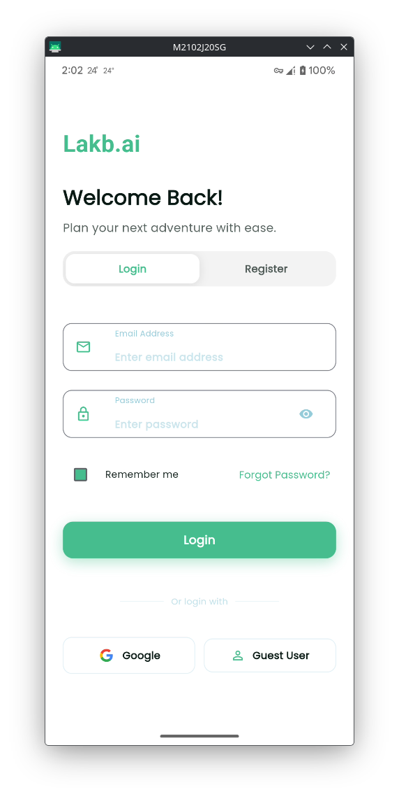
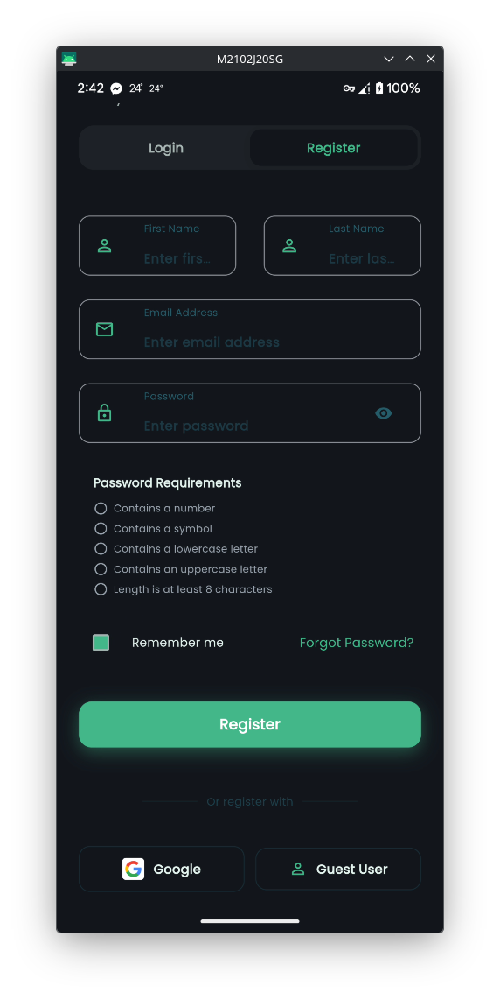
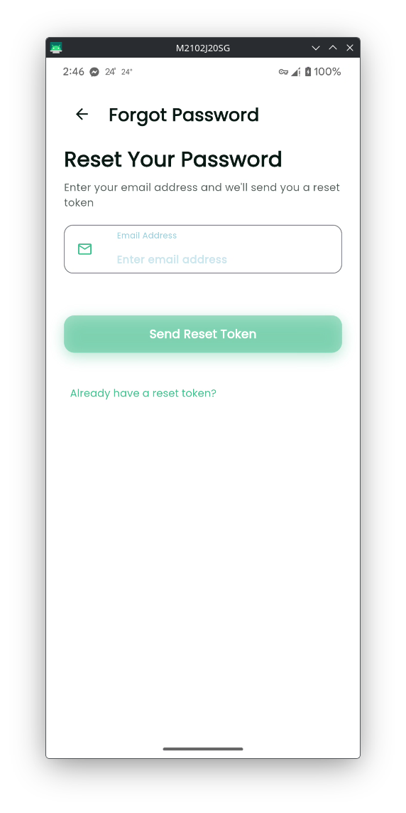
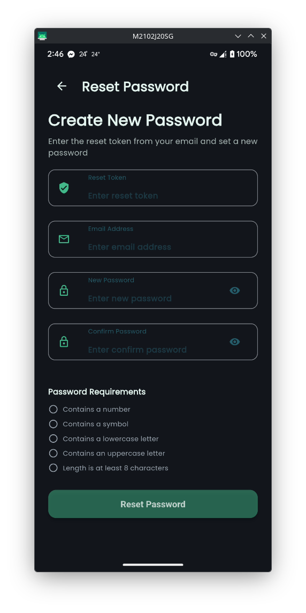
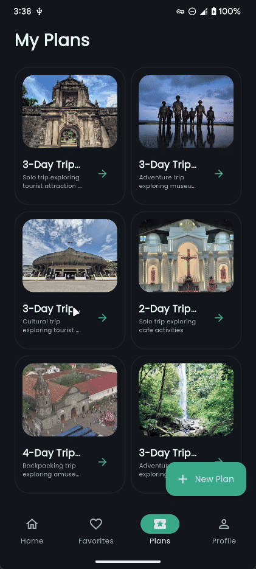
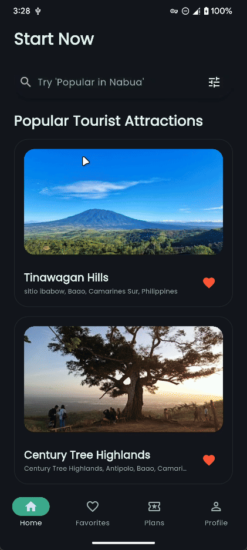
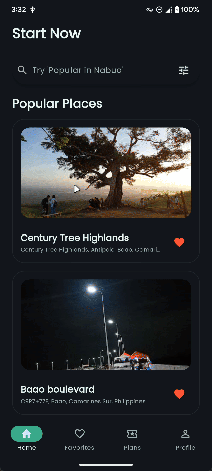
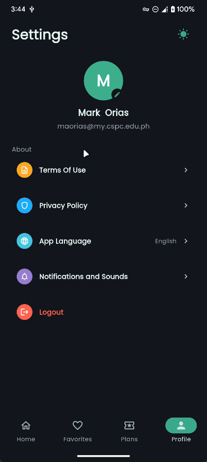

# Lakb.ai - AI-Powered Travel Discovery and Planning System

**Version:** 1.0  
**Team:** LOCaiT  
**Courses:**

- CCCS 106 - Application Development and Emerging Technologies
- CS 319 - Information Assurance and Security
- CS 3110 - Software Engineering 1

**Academic Year:** 2025-2026 (Finals)

---

## Table of Contents

- [Project Overview](#project-overview)
- [Project Context](#project-context)
- [Technical Stack](#technical-stack)
- [Implemented Features](#implemented-features)
- [Architecture](#architecture)
- [Security Implementation](#security-implementation)
- [Data Persistence](#data-persistence)
- [Setup and Installation](#setup-and-installation)
- [Testing](#testing)
- [Team and Roles](#team-and-roles)
- [Documentation](#documentation)
- [Compliance and Privacy](#compliance-and-privacy)
- [Future Enhancements](#future-enhancements)
- [References](#references)

---

## Project Overview

Lakb.ai is a mobile-first AI-driven travel discovery and planning application built with the **Flet framework** (Python + Flutter rendering). The system integrates artificial intelligence with real-world APIs to provide personalized travel recommendations, location-based search, and intelligent itinerary generation.

The application addresses the needs of travelers, local residents, and travel agencies by offering data-driven insights and simplified trip planning through an intuitive interface.

### Target Users

- **Travelers and Tourists** - Discover new attractions, routes, and personalized itineraries
- **Local Residents** - Explore nearby hidden gems and local experiences
- **Travel Agencies** - Promote destinations and monitor popularity trends

### Problem Statement

Traditional travel planning is time-consuming and often relies on generic recommendations. Lakb.ai solves this by leveraging AI to understand user preferences, mood, and context to deliver personalized travel suggestions and automate itinerary creation.

---

## Project Context

This project fulfills the requirements of three collaborative courses:

### Application Development and Emerging Technologies (CCCS 106)

The project demonstrates:

- Competent use of the Flet UI framework (layout, navigation, state management, event handling)
- Implementation of data persistence using Supabase cloud backend
- Integration of AI-powered recommendation engine as the emerging technology component
- Application of software engineering practices (version control, modular structure, documentation)
- Delivery of a functional, responsive mobile interface

### Information Assurance and Security (CS 319)

The project implements secure access control with:

- Strong authentication (email/password, Google OAuth, guest mode)
- Password hashing using industry-standard algorithms
- Session management and timeout handling
- Profile management with self-service capabilities
- Secure configuration management using environment variables
- Comprehensive logging of authentication and user actions

### Software Engineering 1 (CS 3110)

The project demonstrates engineering practices:

- Collaborative team workflow with defined roles and responsibilities
- Version control using Git with meaningful commit history
- Modular architecture with separation of concerns
- Comprehensive documentation (SRS, architecture diagrams, user manual)
- Testing strategy with unit and integration tests
- Agile methodology with iterative development cycles

---

## Technical Stack

| Component            | Technology                                                                                                         |
| -------------------- | ------------------------------------------------------------------------------------------------------------------ |
| **Framework**        | Flet (Python + Flutter)                                                                                            |
| **Backend**          | Python                                                                                                             |
| **Database**         | Supabase (PostgreSQL)                                                                                              |
| **Authentication**   | Supabase Auth with Google OAuth                                                                                    |
| **APIs**             | Google Places API, Google Maps API, Google Gemini API, Supabase API, OpenWeather API, Calendarific API, OpenAQ API |
| **AI**               | Google Gemini AI (Generative AI)                                                                                   |
| **Platform Targets** | Android (Mobile)                                                                                                   |
| **State Management** | Custom controllers with reactive updates                                                                           |
| **Configuration**    | python-dotenv for environment management                                                                           |

---

## Implemented Features

### Core User Flows

#### 1. Authentication and User Management

**Implemented:**

- Secure user registration with email and password
- Google OAuth integration for social sign-in
- Guest mode for exploring without account creation
- Password reset with token-based verification
- Secure session management with automatic timeout
- Password hashing using Supabase security

**Security Features:**

- CSRF protection through secure token handling
- Session timeout and inactivity handling
- Encrypted credential storage
- Protection against credential stuffing

|                                         Login Screen                                          |                                          Register Screen                                          |
| :-------------------------------------------------------------------------------------------: | :-----------------------------------------------------------------------------------------------: |
|  |  |
|                                         _Light Mode_                                          |                                            _Dark Mode_                                            |

|                                          Forgot Password Screen                                          |                                        Reset Password Screen                                         |
| :------------------------------------------------------------------------------------------------------: | :--------------------------------------------------------------------------------------------------: |
|  |  |
|                                               _Light Mode_                                               |                                             _Dark Mode_                                              |

#### 2. AI-Based Travel Recommendation System

**Implemented:**

- Personalized destination suggestions based on user preferences
- Context-aware recommendations using location, mood, and interests
- AI-powered itinerary generation with Google Gemini
- Category-based filtering (Hotels, Restaurants, Attractions, Parks, Shopping, Nightlife)
- Real-time recommendation updates

**AI Integration Details:**

- Google Gemini API for natural language processing
- Custom recommendation algorithm combining user preferences and API data
- Intelligent parsing of destination search queries
- Activity-based itinerary suggestions

|                                        Plan Trip View                                         |                                       Plan Summary View                                        |
| :----------------------------------------------------------------------------------------: | :---------------------------------------------------------------------------------------------: |
|  |  |
|                                       _Plan Trip View_                                        |                                        _Plan Summary View_                                         |

#### 3. Location-Based Search and Discovery

**Implemented:**

- Real-time geolocation-based search
- Google Places API integration for destination data
- Location search with "Popular in [Location]" queries
- Distance calculation and proximity-based sorting
- Category filtering for refined searches
- Integration with device GPS (where permissions allow)

|                                       Search View                                        |                                       Filter View                                        |
| :--------------------------------------------------------------------------------------------: | :----------------------------------------------------------------------------------------------: |
|  |  |
|                                        _Search View_                                        |                                        _Filter View_                                         |

#### 4. Maps, Destination Details, and Reviews

**Implemented:**

- Google Maps integration for route visualization
- Destination marker display

- Comprehensive destination pages with:
  - High-quality photos from Google Places
  - Detailed descriptions and information
  - User ratings and review counts
  - Operating hours and contact information
  - Address and location details
  - Category and type classification

|                                        About Destination                                         |
| :----------------------------------------------------------------------------------------: |
|  |
|                                       _About View_                                        |


#### 6. Favorites and Saved Content

**Implemented:**

- Save favorite destinations to user profile
- Persistent favorites storage in Supabase
- Quick access to saved locations
- Remove favorites functionality
- Favorites synchronization across devices

|                                        Favorites Screen                                         |
| :----------------------------------------------------------------------------------------: |
|  |
|                                       _Favorites View_                                        |

#### 7. Travel Itinerary Generation and Management

**Implemented:**

- AI-generated travel plans based on:
  - User-selected destinations
  - Time constraints and duration
  - Travel preferences and pace
  - Activity types and categories
- Save generated itineraries
- View and edit saved travel plans
- Delete unwanted itineraries
- Day-by-day schedule breakdown
- Activity time allocation

|                                      Plan Trip Screen                                       |                                       Plan Summary Screen                                        |
| :------------------------------------------------------------------------------------------: | :----------------------------------------------------------------------------------------------: |
|  |  |
|                                         _Plan Trip_                                          |                                          _Plan Summary_                                          |

#### 8. Settings and Profile Management

**Implemented:**

- Theme toggle (light/dark mode)
- Language preferences (placeholder)
- Notification settings (placeholder)
- Privacy controls (placeholder)
- About and legal information (placeholder)
- Logout functionality
- User profile viewing and editing
- Update personal information (name, email)
- Change password

|                                        Profile Screen                                         |
| :--------------------------------------------------------------------------------------------: |
|  |
|                                        _Profile View_                                         |


### Navigation and UI Features

**Implemented:**

- Bottom navigation bar with icon-based routing
- Responsive layout adapting to different screen sizes
- Loading indicators for asynchronous operations
- Error handling with user-friendly messages
- Search bar with autocomplete suggestions
- Floating action buttons for primary actions
- Status dialogs for feedback
- Smooth page transitions

---

## Architecture

### System Design

The application follows a modular, layered architecture separating concerns:

```
/src
  ├── main.py                 # Application entry point and routing
  ├── /core                   # Core configuration and utilities
  │   ├── config.py           # Environment configuration
  │   ├── supabase_client.py  # Database client initialization
  │   ├── connectivity.py     # Network connectivity monitoring
  │   └── theme.py            # UI theme definitions
  ├── /services               # Business logic and external integrations
  │   ├── ai_engine.py        # AI recommendation logic
  │   ├── api_service.py      # Google Places/Maps API integration
  │   ├── auth_service.py     # Authentication and authorization
  │   ├── favorites_service.py # Favorites management
  │   ├── geolocation_service.py # Location services
  │   ├── plans_service.py    # Travel plans management
  │   └── profile_service.py  # User profile operations
  ├── /state                  # State management and controllers
  │   ├── __init__.py         # State package initialization
  │   ├── app_state_manager.py       # Global application state
  │   ├── auth_state_controller.py   # Authentication state
  │   ├── navigation_controller.py   # Navigation flow
  │   ├── places_state_controller.py # Places data state
  │   ├── profile_state_controller.py # Profile state
  │   ├── favorites_state_controller.py # Favorites state
  │   └── service_manager.py  # Service dependency injection
  ├── /views                  # UI pages and screens
  │   ├── __init__.py         # Views package initialization
  │   ├── splash.py           # Splash screen
  │   ├── login_view.py       # Login and registration
  │   ├── send_token_view.py  # Password reset token entry
  │   ├── password_reset_view.py # Password recovery
  │   ├── home_view.py        # Main discovery screen
  │   ├── favorites_view.py   # Saved favorites
  │   ├── plan_trip.py        # Itinerary creation
  │   ├── plans_view.py       # Saved itineraries
  │   ├── profile_view.py     # User profile
  │   ├── settings_view.py    # Application settings
  │   └── /components         # Reusable UI components
  │       ├── __init__.py     # Components package initialization
  │       ├── destination_card.py # Destination display card
  │       ├── feature_card.py # Feature highlight card
  │       ├── plan_card.py    # Travel plan card
  │       ├── plan_summary.py # Plan summary view
  │       ├── search_bar.py   # Search input component
  │       ├── nav_bar.py      # Bottom navigation bar
  │       ├── floating_action_button.py # FAB component
  │       ├── loading_indicator.py # Loading spinner
  │       └── status_dialog.py # Status/alert dialogs
  ├── /assets                 # Static resources
  │   └── /icons              # Application icons and images
  └── /storage                # Local storage utilities
```

### Design Principles

- **Separation of Concerns:** Services, state, and views are logically separated
- **Reactive State Management:** Controllers manage state with observer patterns
- **Dependency Injection:** ServiceManager provides centralized service access
- **Modular Components:** Reusable UI widgets for consistent design
- **Error Boundaries:** Graceful error handling at all layers

For the architecture diagram, please refer to the [SRS documentation](./docs/SRS.pdf).

---

## Security Implementation

### Authentication Security

- **Password Hashing:** Industry-standard bcrypt hashing via Supabase
- **OAuth Integration:** Secure Google sign-in flow with token validation
- **Session Management:** Automatic timeout after inactivity
- **Password Reset:** Token-based verification with time expiration
- **Guest Mode:** Limited access without credential exposure

### Data Security

- **Encryption in Transit:** HTTPS for all API communications
- **Encryption at Rest:** Supabase encrypted storage
- **Secure Configuration:** Environment variables for sensitive data
- **API Key Protection:** Keys stored in .env, excluded from version control

### Access Control

- **Authentication Required:** Most features require user authentication
- **Permission-Based Views:** UI elements adapt to authentication state
- **Session Validation:** Token verification on each request
- **Secure Logout:** Complete session termination and state clearing

### Compliance

The application adheres to:

- **Data Privacy Act of 2012 (RA 10173)** - Philippine privacy compliance
- **OWASP Top 10** - Protection against common vulnerabilities
- **User Consent:** Explicit permission for GPS and personal data access

---

## Data Persistence

### Database Schema

The application uses Supabase (PostgreSQL) with the following primary tables:

- **users** - User accounts and authentication
- **profiles** - Extended user information and preferences
- **favorites** - User-saved destinations
- **plans** - Saved itineraries and schedules

### Data Management

- **Cloud Sync:** Real-time synchronization across devices
- **Offline Handling:** Graceful degradation when offline
- **Data Validation:** Input sanitization and type checking
- **Error Recovery:** Automatic retry and fallback mechanisms

---

## Setup and Installation

### Prerequisites

- Python 3.11 or higher
- Git
- Google Cloud account (for Maps/Places API keys)
- Supabase account (for database and authentication)
- Google AI Studio account (for Gemini API)

### Environment Configuration

1. Clone the repository:

```bash
git clone <repository-url>
cd lakb.ai
```

2. Create virtual environment:

```bash
python -m venv .venv
source .venv/bin/activate  # On Windows: .venv\Scripts\activate
```

3. Install dependencies:

```bash
pip install -e .
```

4. Configure environment variables:

```bash
cp .env.example .env
# Edit .env with your API keys and credentials
```

Required environment variables:

- `SUPABASE_URL` - Your Supabase project URL
- `SUPABASE_KEY` - Supabase anonymous key
- `GOOGLE_PLACES_API_KEY` - Google Places API key
- `GOOGLE_MAPS_API_KEY` - Google Maps API key
- `GEMINI_API_KEY` - Google Gemini API key
- `OPENWEATHER_API_KEY` - OpenWeather API key for weather data
- `CALENDARIFIC_API_KEY` - Calendarific API key for public holidays
- `OPENAQ_API_KEY` - OpenAQ API key for air quality data

### Supabase Database Setup

The application requires a Supabase project with authentication and database tables configured.

#### 1. Create Supabase Project

1. Go to [https://supabase.com](https://supabase.com) and create a free account
2. Create a new project and note your project URL and API keys
3. Copy the `SUPABASE_URL` and `SUPABASE_KEY` (anon/public key) to your `.env` file

#### 2. Configure Authentication

**Enable Authentication Providers:**

1. In your Supabase dashboard, navigate to **Authentication → Providers**
2. Enable **Email** provider (enabled by default)
3. Enable **Google** provider:
   - Create OAuth credentials in Google Cloud Console
   - Add authorized redirect URI: `https://<your-project-ref>.supabase.co/auth/v1/callback`
   - Add the Google OAuth Client ID and Client Secret to Supabase
4. Configure Site URL and Redirect URLs:
   - Site URL: `http://localhost:8550` (for development)
   - Redirect URLs: Add `http://localhost:8550/oauth_callback` and `lakbai://oauth_callback` (for Android deep linking)

#### 3. Create Database Tables

Run the following SQL queries in the Supabase SQL Editor (**Database → SQL Editor**):

**Create Profiles Table:**

```sql
-- Profiles table for extended user information
CREATE TABLE profiles (
  id UUID REFERENCES auth.users(id) PRIMARY KEY,
  email TEXT NOT NULL,
  first_name TEXT DEFAULT '',
  last_name TEXT DEFAULT '',
  avatar_url TEXT,
  created_at TIMESTAMP WITH TIME ZONE DEFAULT NOW(),
  updated_at TIMESTAMP WITH TIME ZONE DEFAULT NOW()
);

-- Enable Row Level Security
ALTER TABLE profiles ENABLE ROW LEVEL SECURITY;

-- Allow users to read their own profile
CREATE POLICY "Users can view own profile"
  ON profiles FOR SELECT
  USING (auth.uid() = id);

-- Allow users to insert their own profile
CREATE POLICY "Users can insert own profile"
  ON profiles FOR INSERT
  WITH CHECK (auth.uid() = id);

-- Allow users to update their own profile
CREATE POLICY "Users can update own profile"
  ON profiles FOR UPDATE
  USING (auth.uid() = id);
```

**Create Favorites Table:**

```sql
-- Favorites table for user-saved places
CREATE TABLE favorites (
  id BIGSERIAL PRIMARY KEY,
  user_id UUID REFERENCES auth.users(id) ON DELETE CASCADE NOT NULL,
  place_id TEXT NOT NULL,
  data JSONB NOT NULL,
  created_at TIMESTAMP WITH TIME ZONE DEFAULT NOW(),
  UNIQUE(user_id, place_id)
);

-- Create index for faster queries
CREATE INDEX idx_favorites_user_id ON favorites(user_id);
CREATE INDEX idx_favorites_place_id ON favorites(place_id);

-- Enable Row Level Security
ALTER TABLE favorites ENABLE ROW LEVEL SECURITY;

-- Allow users to view their own favorites
CREATE POLICY "Users can view own favorites"
  ON favorites FOR SELECT
  USING (auth.uid() = user_id);

-- Allow users to insert their own favorites
CREATE POLICY "Users can insert own favorites"
  ON favorites FOR INSERT
  WITH CHECK (auth.uid() = user_id);

-- Allow users to delete their own favorites
CREATE POLICY "Users can delete own favorites"
  ON favorites FOR DELETE
  USING (auth.uid() = user_id);
```

**Create Plans Table:**

```sql
-- Plans table for travel itineraries
CREATE TABLE plans (
  id BIGSERIAL PRIMARY KEY,
  user_id UUID REFERENCES auth.users(id) ON DELETE CASCADE NOT NULL,
  title TEXT NOT NULL,
  description TEXT,
  image_url TEXT,
  data JSONB NOT NULL,
  created_at TIMESTAMP WITH TIME ZONE DEFAULT NOW(),
  updated_at TIMESTAMP WITH TIME ZONE DEFAULT NOW()
);

-- Create index for faster queries
CREATE INDEX idx_plans_user_id ON plans(user_id);

-- Enable Row Level Security
ALTER TABLE plans ENABLE ROW LEVEL SECURITY;

-- Allow users to view their own plans
CREATE POLICY "Users can view own plans"
  ON plans FOR SELECT
  USING (auth.uid() = user_id);

-- Allow users to insert their own plans
CREATE POLICY "Users can insert own plans"
  ON plans FOR INSERT
  WITH CHECK (auth.uid() = user_id);

-- Allow users to update their own plans
CREATE POLICY "Users can update own plans"
  ON plans FOR UPDATE
  USING (auth.uid() = user_id);

-- Allow users to delete their own plans
CREATE POLICY "Users can delete own plans"
  ON plans FOR DELETE
  USING (auth.uid() = user_id);
```

#### 4. Configure Storage for Profile Images

1. In Supabase dashboard, go to **Storage**
2. Create a new bucket named `avatars`
3. Make the bucket **public** (for profile image access)
4. Set up RLS policies for the storage bucket:

```sql
-- Allow authenticated users to upload their own avatars
CREATE POLICY "Users can upload own avatar"
  ON storage.objects FOR INSERT
  WITH CHECK (
    bucket_id = 'avatars'
    AND auth.uid()::text = (storage.foldername(name))[1]
  );

-- Allow users to update their own avatars
CREATE POLICY "Users can update own avatar"
  ON storage.objects FOR UPDATE
  USING (
    bucket_id = 'avatars'
    AND auth.uid()::text = (storage.foldername(name))[1]
  );

-- Allow public read access to avatars
CREATE POLICY "Public avatar access"
  ON storage.objects FOR SELECT
  USING (bucket_id = 'avatars');
```

#### 5. Verify Database Setup

After running all SQL queries, verify that:

- All three tables (`profiles`, `favorites`, `plans`) exist
- Row Level Security (RLS) is enabled on all tables
- Storage bucket `avatars` is created and accessible
- Authentication providers (Email, Google) are enabled

### Running the Application

**Development Testing (Desktop):**

```bash
# For quick testing during development only
flet run src/main.py
```

**Android APK Build (Primary Platform):**

```bash
python build_apk.py
```

---

## Testing

The project includes comprehensive testing documentation covering unit tests, integration tests, authentication flows, and manual UI testing checklists.

For detailed testing instructions, test coverage information, and step-by-step testing procedures, please refer to:

**[Testing Documentation](./tests/QUICKTEST.md)**

### Quick Start

Run all tests using the test runner script:

```bash
# Using the test runner script (recommended)
python tests/run_all_tests.py

# Or directly with pytest
pytest tests/

# Run with HTML coverage report
python tests/run_all_tests.py --html
```

For detailed testing instructions, test organization, coverage goals, and troubleshooting, see the **[Testing Documentation](./tests/QUICKTEST.md)**.

---

## Team and Roles

| Role                            | Name                  | Responsibilities                                     |
| ------------------------------- | --------------------- | ---------------------------------------------------- |
| Project Manager                 | Sean Xander B. Aquino | Product vision, feature prioritization, coordination |
| Database Engineer & Logic Engineer | Lawrence Atienza      | Data architecture, initial database schema design, code debugging, logic refinement |
| Database Engineer & UI/UX Designer & Security Engineer | Mark Joseph C. Orias  | Data architecture, Supabase setup, interface design, user experience, security implementation, authentication |

### Contribution Matrix

All team members contributed to:

- Code implementation (traceable via Git commits)
- Documentation preparation
- Testing and quality assurance
- Presentation materials

---

## Documentation

Complete project documentation is available in the `/docs` folder:

1. [**Project Overview & Problem Statement**](#project-overview)
2. [**Feature List & Scope Table**](#implemented-features) (what's in/out)
3. [**Architecture Diagram**](#architecture) (simple block diagram is fine; include Flet + data + emerging tech layer)
4. [**Data Model**](#data-persistence) (ERD or JSON schema overview)
5. [**Emerging Tech Explanation**](./docs/SRS.pdf) (why chosen, how integrated, limitations)
6. [**Setup & Run Instructions**](#setup-and-installation) (including dependency install and platform targets)
7. [**Testing Summary**](./tests/QUICKTEST.md) (how to run, coverage notes)
8. [**Team Roles & Contribution Matrix**](#team-and-roles)
9. [**Risk / Constraint Notes & Future Enhancements**](#future-enhancements)
10. **Individual Reflection** (per member: 150–200 words)

For detailed technical documentation, see [docs/SRS.md](./docs/SRS.md)

---

## Compliance and Privacy

### Data Privacy Act Compliance

Lakb.ai ensures compliance with the **Data Privacy Act of 2012 (RA 10173)**:

- User consent is obtained before accessing GPS and personal data
- Sensitive data (credentials, tokens) stored securely
- All client-server communications encrypted via HTTPS
- Users can view and delete their personal data
- Clear privacy policy and terms of service

### API Usage and Limits

| API               | Free Tier           | Usage Model                          |
| ----------------- | ------------------- | ------------------------------------ |
| Google Places API | $200/month credit   | Sufficient for prototype and testing |
| Google Maps API   | $200/month credit   | Shared with Places quota             |
| Google Gemini AI  | Free tier available | Rate-limited requests                |
| Supabase          | Free tier           | Up to 500MB database, 2GB bandwidth  |
| OpenWeather API   | Free tier available | 1,000 calls/day, 60 calls/minute     |
| Calendarific API  | Free tier available | 1,000 calls/month                    |
| OpenAQ API        | Free tier available | Rate-limited requests                |

---

## Future Enhancements

Planned features for future releases:

1. **Weather Integration**

   - OpenWeatherMap API for weather-based itinerary adjustments
   - Real-time weather alerts for travel dates

2. **Social Features**

   - Community travel sharing
   - User reviews and ratings
   - Collaborative trip planning

3. **Offline Capabilities**

   - Offline itinerary caching
   - Download maps for offline use
   - Queue sync when connection restored

4. **Enhanced AI**

   - Sentiment analysis of user reviews
   - Predictive travel trend analysis
   - Natural language query processing

5. **Advanced Analytics**

   - Travel statistics dashboard
   - Budget tracking and estimation
   - Carbon footprint calculation

6. **Multi-language Support**
   - Localization for multiple languages
   - Currency conversion
   - Regional content customization

---

## References

- ISO/IEC/IEEE 29148:2018 - Requirements Engineering
- [Google Maps Platform Documentation](https://developers.google.com/maps/documentation)
- [Google Places API Documentation](https://developers.google.com/maps/documentation/places/web-service)
- [Google Gemini API Documentation](https://ai.google.dev/docs)
- [Flet Framework Documentation](https://flet.dev/docs)
- [Supabase Documentation](https://supabase.com/docs)
- [OpenWeather API Documentation](https://openweathermap.org/api)
- [Calendarific API Documentation](https://calendarific.com/api-documentation)
- [OpenAQ API Documentation](https://docs.openaq.org/)
- Data Privacy Act of 2012 (Republic Act No. 10173)
- OWASP Top 10 Web Application Security Risks (2023)
- OWASP Mobile Application Security Project

---

## License

This project is developed as a collaborative effort for:

- **CCCS 106** - Application Development and Emerging Technologies
- **CS 319** - Information Assurance and Security
- **CS 3110** - Software Engineering 1

All rights reserved (c) 2025 **Team LOCaiT**.

---

## Acknowledgments

- **Instructor:** Mr. Allan Ibo Jr.
- **Institution:** Camarines Sur Polytechnic Colleges
- **APIs:** Google Cloud Platform, Supabase, OpenWeather, Calendarific, OpenAQ
- **Framework:** Flet Development Team
- **AI:** Google Gemini AI

---

**For questions or support, please contact the development team through the project repository.**
